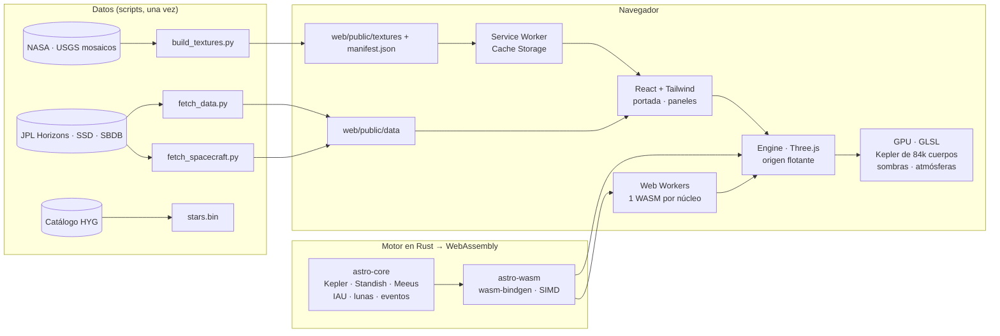

# Arquitectura

Cómo está montado el simulador, de los datos de JPL a los píxeles.



## Capas

| Carpeta | Qué hace |
|---|---|
| `crates/astro-core` | Astronomía pura en Rust, sin dependencias: tiempo (TDB), ecuación de Kepler, elementos de Standish (JPL), teoría lunar de Meeus, rotación IAU, lunas de JPL SSD, cuerpos pequeños y búsqueda de eventos. Validado contra Horizons y el catálogo de eclipses de la NASA. |
| `crates/astro-wasm` | Puente `wasm-bindgen`: calcula el estado de todo el sistema en un instante y lo deja en buffers que JavaScript lee sin copias. Compilado con SIMD de 128 bits y `wasm-opt -O3`. |
| `web/src/engine` | Escena en Three.js: cuerpos, órbitas, marcadores, etiquetas, sombras analíticas, atmósferas, estrellas, cuerpos pequeños (GPU o workers), reloj y ajustes gráficos. |
| `web/src/data` | Carga y catálogos: mundo (`world.ts`), texturas por niveles, naves (Hermite), eventos, tours e instalador offline. |
| `web/src/ui` | Componentes React + Tailwind: portada, barra de tiempo, barra lateral, ficha, gráficos, calendario, tours. |
| `scripts/` | Descarga y preparación de datos y texturas (Python). |

## Decisiones clave

- **Origen flotante.** Las posiciones se calculan en f64 (Rust y JS). Cada frame, todo se coloca relativo al cuerpo enfocado antes de subirlo a la GPU (f32), así que no hay temblores ni a 170 au (Voyager 1).
- **Profundidad logarítmica.** Permite dibujar a la vez la superficie de Fobos (km) y la órbita de Eris (decenas de au) sin z-fighting.
- **Kepler en el vertex shader.** Los 84k asteroides y cometas suben sus elementos orbitales una sola vez; por frame solo cambian dos uniforms (tiempo y foco). El tiempo se parte en dos floats (`tHigh + tLow`) para no perder precisión en f32. El motor Rust multinúcleo queda como alternativa y un test visual comprueba que los dos coinciden.
- **Sombras analíticas.** En vez de mapas de sombras se calcula, por píxel, qué fracción del disco solar tapa cada cuerpo (solape exacto de dos círculos). La separación angular se obtiene con `atan2(|a×b|, a·b)`: con `acos` la precisión de float32 no alcanza para ángulos de fracciones de grado.
- **Atmósferas físicas.** Dispersión Rayleigh + Mie de un rebote (Nishita) integrada por píxel, con composición premultiplicada (luz dispersada + fondo × transmitancia).
- **Texturas por niveles.** Cada cuerpo arranca en 1K y sube al nivel elegido cuando la imagen está en caché; la portada puede instalar todo en Cache Storage (Service Worker) y la app funciona sin conexión.
- **Dos ramas.** `DECOMPILED` es la fuente; `COMPILED` es la misma web con el WASM ya compilado, para ejecutar solo con Node.

## Precisión (tests)

| Qué | Referencia | Resultado |
|---|---|---|
| Planetas 1800–2050 | JPL Horizons (DE441) | < 0,02° la mayoría; peor caso Saturno 0,17° |
| Luna (Meeus) | Horizons | 3–10 km |
| Ío, Titán, Tritón | Horizons | < 0,2° |
| Eclipses solares 2024–2027 | Catálogo NASA (Espenak) | hora < 2,5 min, γ < 0,0014 |
| Eclipses lunares 2025–2026 | Catálogo NASA | < 1 min |
| Parker Solar Probe (perihelio 2024) | NASA | 6,863 millones de km |

## Comandos

```bash
cargo test --workspace          # astronomía contra Horizons y NASA
cargo clippy --workspace --all-targets -- -D warnings
npm run lint && npm run typecheck
npm test                        # Vitest
npm run build && npm run test:e2e   # Playwright
```
