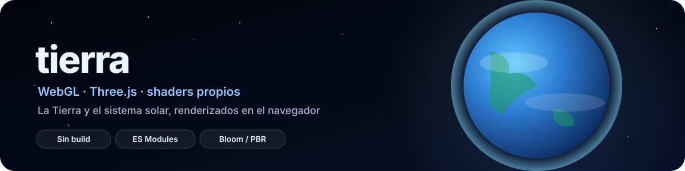

<p align="center">
  
</p>

<p align="center">
  
  
</p>

---

Dos escenas en WebGL renderizadas con [Three.js](https://threejs.org), sin ningún paso de build:
HTML plano + módulos ES cargados directamente desde CDN vía `importmap`. Clonar y abrir ya
funciona.

## `index.html` — La Tierra

Un globo terráqueo con shaders propios (`js/shaders.js`): superficie día/noche con transición
según el ángulo del sol, nubes independientes rotando a su propia velocidad, atmósfera con
dispersión en los bordes (efecto Fresnel) y bloom de post-procesado
(`EffectComposer` + `UnrealBloomPass`). Texturas de la NASA/Solar System Scope a 4K
(`earth-day`, `earth-night`, `clouds`, `earth-topology` para el relieve).

## `solar.html` — El sistema solar

Los ocho planetas y la Luna, con tamaños **proporcionales a sus radios reales** y distancias
orbitales comprimidas con una potencia (a escala real, Neptuno quedaría fuera de la pantalla por
kilómetros de distancia — ver el comentario al principio de `js/solar.js`). Cámara orbital libre
con `OrbitControls`.

## Ejecutar

Los módulos ES necesitan servirse por HTTP (no vale abrir el `.html` directo con `file://`):

```bash
python3 -m http.server 8000
# abrir http://localhost:8000/index.html  o  /solar.html
```

Sin dependencias que instalar — Three.js y sus addons se cargan desde `cdn.jsdelivr.net` mediante
el `importmap` que ya está en cada HTML.

## Estructura

```
index.html / solar.html   las dos escenas
css/                       estilos de cada una (loader, overlay)
js/main.js                 escena de la Tierra: cámara, luces, postproceso, animación
js/solar.js                escena del sistema solar: planetas, órbitas, escalas
js/shaders.js               GLSL propio: tierra, atmósfera, nubes
textures/                   texturas 2K/4K de planetas, lunas, estrellas y la propia Tierra
```

## Créditos de texturas

Texturas planetarias de dominio público / Creative Commons vía
[Solar System Scope](https://www.solarsystemscope.com/textures/) y NASA Visible Earth. Sin
afiliación con ninguno de los dos proyectos.
